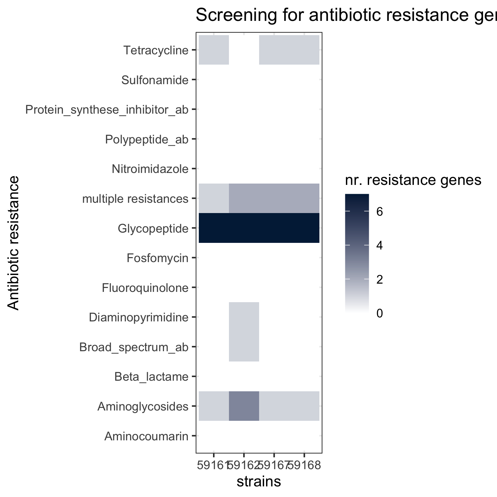

Antibiotic Resistance genes
===========================

Mass screening of contigs for antimicrobial resistance or virulence
genes with bioinformatic tool **abricate** by Seemann T. In total 4
different databases for ab resistance genes were screened.

-   Abricate, Github
    <a href="https://github.com/tseemann/abricate" class="uri">https://github.com/tseemann/abricate</a>
    -   NCBI AMRFinderPlus - doi: 10.1128/AAC.00483-19
    -   CARD -
        <a href="doi:10.1093/nar/gkw1004" class="uri">doi:10.1093/nar/gkw1004</a>
    -   Resfinder -
        <a href="doi:10.1093/jac/dks261" class="uri">doi:10.1093/jac/dks261</a>
    -   ARG-ANNOT -
        <a href="doi:10.1128/AAC.01310-13" class="uri">doi:10.1128/AAC.01310-13</a>

Minimum DNA %identity 90, Minimum DNA %coverage 90

    conda activate abricate
    abricate --minid [90] --mincov [90] --db ncbi --fofn fofn.txt >results_ncbi.tab
    abricate --summary results_ncbi.tab > summary.txt

Manually screened in excel file, grouped by antibiotic classes and
finally converted to csv and imported into R studio.

-   Glycopeptide
-   Tetracycline
-   Aminoglycoside
-   Aminocoumarin
-   Diaminopyrimidine
-   Fosfomycin
-   Nitroimidazole
-   Polypeptide antibiotic
-   Sulfomanide
-   Fluoroquinolone
-   *β*-lactam antibiotic
-   Broad-spectrum antimicrobial activity
-   Protein-synthese inhibitor antibiotic

Database comparison
-------------------

  &gt; So
called hypothetical ab genes are handled differently dependent on the
database in use

Annotation of specific ab genes
-------------------------------

  &gt;
clustering of glycopeptide resistance in e.coli strains , whereas
E.faecium has a higher range of antibiotic resitances.
