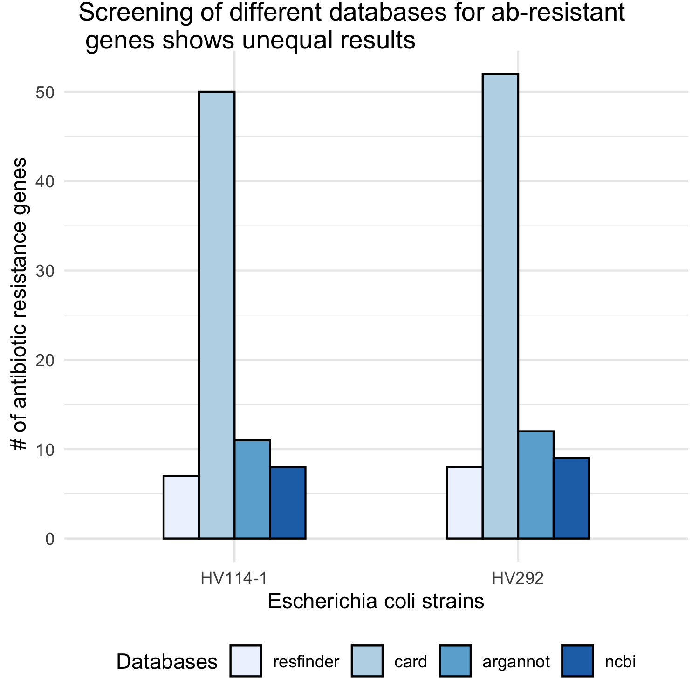
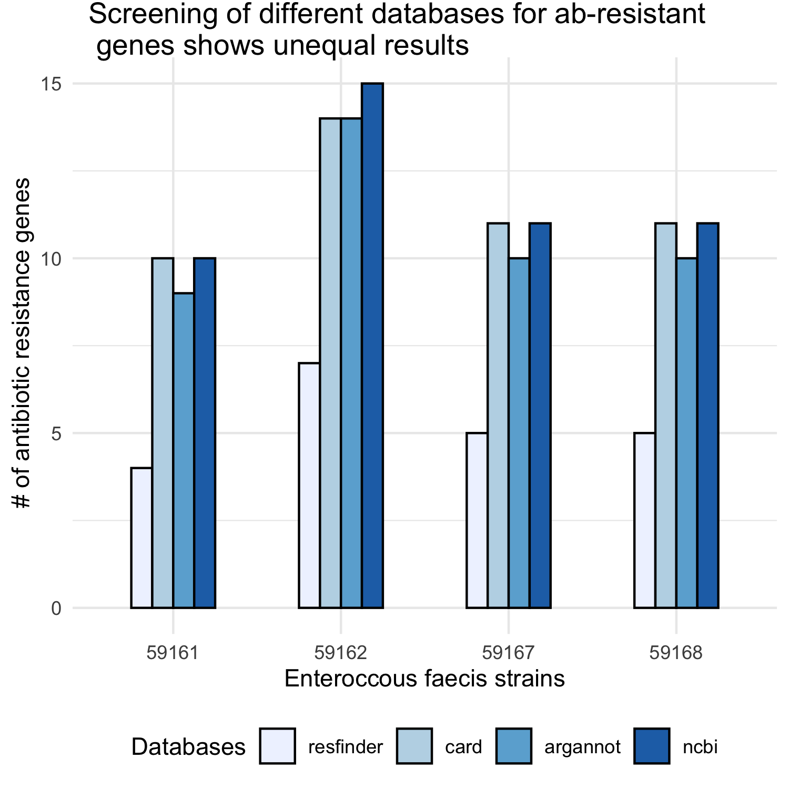
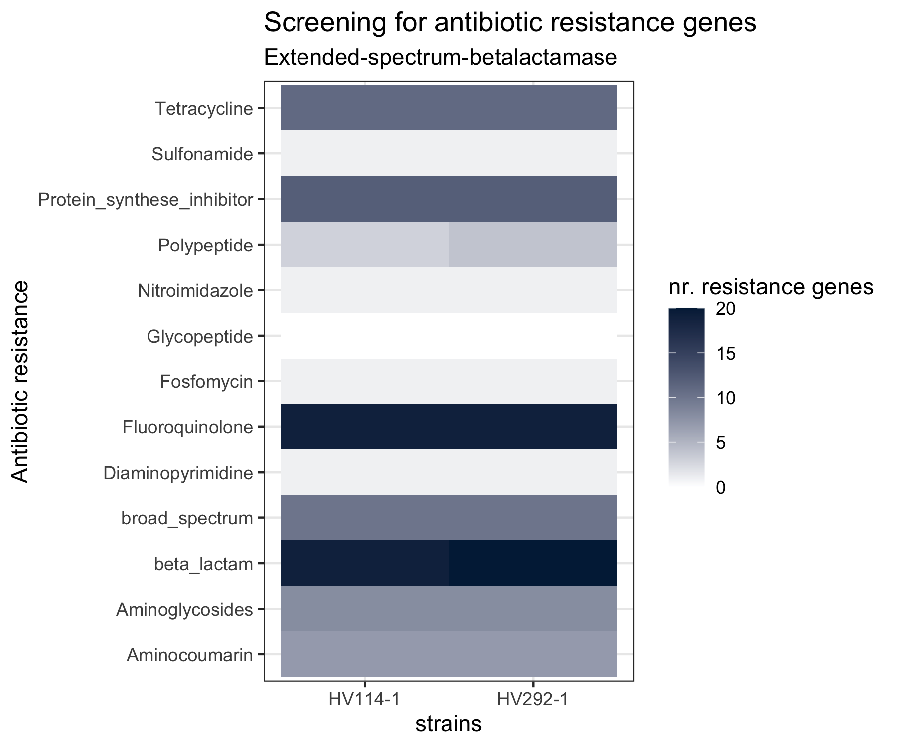
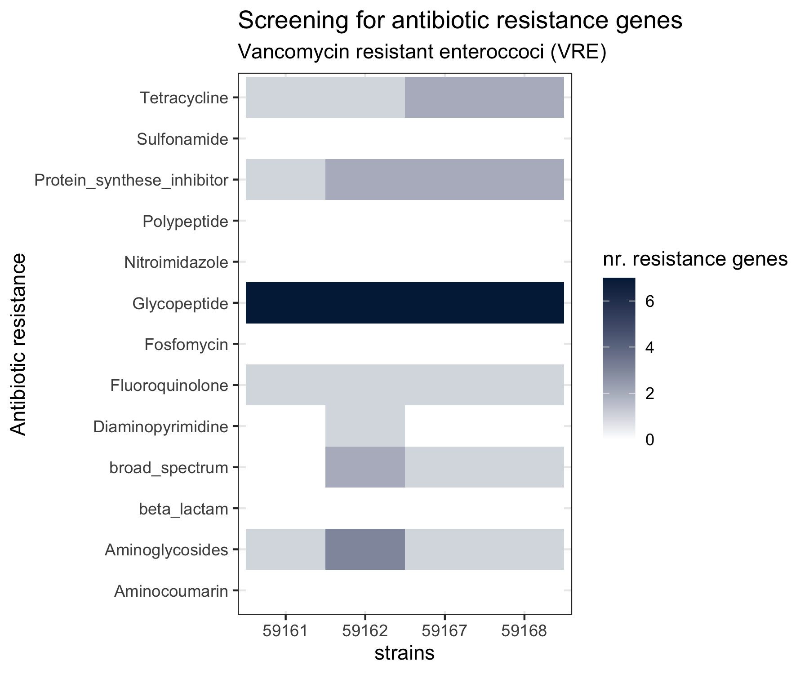

```{r setup, include=FALSE}
knitr::opts_chunk$set(echo = TRUE)
knitr::opts_chunk$set(eval = FALSE)
```

# Antibiotic Resistance genes 
Mass screening of contigs for antimicrobial resistance or virulence genes with bioinformatic tool **abricate** by Seemann T. In total 4 different databases for ab resistance genes were screened.

* Abricate, Github <https://github.com/tseemann/abricate>
  + NCBI AMRFinderPlus - doi: 10.1128/AAC.00483-19
  + CARD - doi:10.1093/nar/gkw1004
  + Resfinder - doi:10.1093/jac/dks261
  + ARG-ANNOT - doi:10.1128/AAC.01310-13

Minimum DNA %identity 90, Minimum DNA %coverage 90

```{bash, }
conda activate abricate
abricate --minid [90] --mincov [90] --db ncbi --fofn fofn.txt >results_ncbi.tab
abricate --summary results_ncbi.tab > summary.txt
```


Manually screened in excel file, grouped by antibiotic classes and finally converted to csv and imported into R studio.

* Glycopeptide
* Tetracycline
* Aminoglycoside
* Aminocoumarin
* Diaminopyrimidine
* Fosfomycin
* Nitroimidazole
* Polypeptide antibiotic
* Sulfomanide
* Fluoroquinolone
* $\beta$-lactam antibiotic
* Broad-spectrum antimicrobial activity
* Protein-synthese inhibitor antibiotic

## Database comparison





> So called hypothetical ab genes are handled differently dependent on the database in use

## Annotation of specific ab genes




> clustering of glycopeptide resistance in e.coli strains , whereas E.faecium has a higher range of antibiotic resitances.